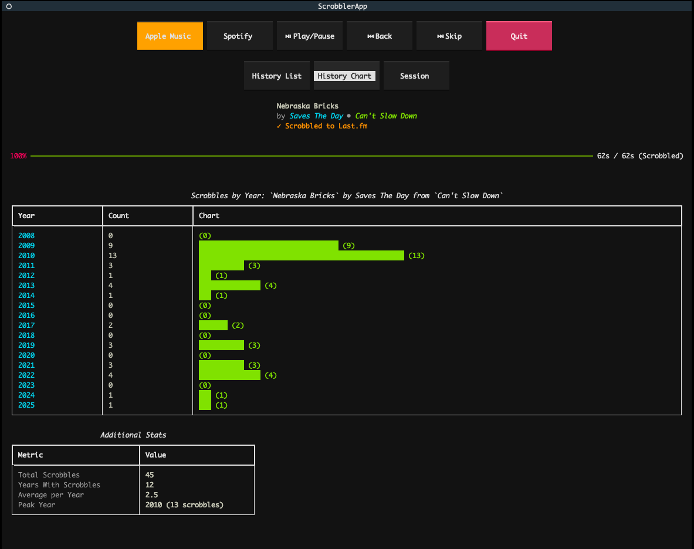
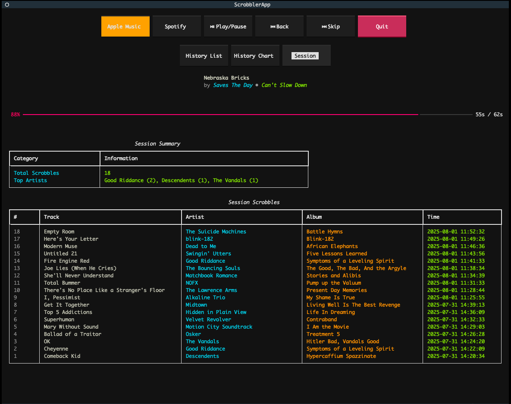

# py-scrobbler

py-scrobbler is a tool for tracking and logging your music listening activity to Last.fm from Apple Music and Spotify.

It provides a Text User Interface (TUI) dashboard with real-time scrobbling, a FastAPI backend for web integration, and a command-line loop for simple usage. 

The application also supports syncing your Last.fm library in a PostgreSQL database for deeper insights and statistics.

## Features

- **FastAPI**: A high-performance web framework for building APIs.
- **pylast**: A Python interface to Last.fm's API.
- **applescript**: A Python library to run AppleScript commands, used to interact with the Apple Music application.
- **spotipy**: A Python interface to Spotify's API.
- **Textual**: A TUI (Text User Interface) framework for Python, used to create an interactive terminal interface.
- **postgreSQL**: Object-relational database system for storing scrobble data. This is not required but recommended for deeper insights and statistics.
- **SQLAlchemy**: SQL toolkit and Object-Relational Mapping (ORM) library for Python, used to interact with the PostgreSQL database.

## Getting Started

### Prerequisites

- Python 3.10+
- Apple Music application installed on your macOS (if you want to scrobble from Apple Music)
- Spotify account (if you want to scrobble from Spotify. API credential docs: https://developer.spotify.com/documentation/web-api)
- Last.fm account and API credentials (https://www.last.fm/api/account/create)
- postreSQL database (optional but recommended)

### Installation

1. **Clone the repository:**
    ```sh
    git clone https://github.com/alex-dulac/py-scrobbler.git
    cd py-scrobbler
    ```

2. **Set up a virtual environment:**
    ```sh
    python -m venv venv
    source venv/bin/activate  # On Windows use `venv\Scripts\activate`
    ```

3. **Install the required packages:**
    ```sh
    pip install -r requirements.txt
    ```

4. **Create a `.env` file:**
   Copy the `.env.example` file to `.env` and fill in your credentials and other necessary environment variables.
    ```sh
    cp .env.example .env
    ```

## Syncing your Last.fm library with your PostgreSQL database

To sync your Last.fm library scrobbles with your PostgreSQL database, run the following script:

```sh
python -m scripts.sync_scrobbles
```

To sync reference data for artists, albums, and tracks, run:

```sh
python -m scripts.sync_ref_data
```

Note that syncing your entire Last.fm library may take a while depending on the number of scrobbles you have.


## Running the Applications

You can run py-scrobbler in three different ways:

   - A Text User Interface (TUI) application (recommended)
   - A FastAPI web application 
   - A simple command line loop that prints the current song and scrobble status

### Text User Interface (TUI)

The TUI application provides an interactive terminal interface with visual elements like progress bars and formatted text.

#### The History Chart represents the current song scrobbles broken down by year


#### The Session displays all scrobbled tracks during app usage


1. **Start the TUI:**
   ```sh
    python textual_app.py
    ```
   
Features of the TUI:
- Switch between Apple Music and Spotify with a button click
- Visual progress bar showing scrobble progress
- Session statistics showing top artists and repeat scrobbles
- Process pending scrobbles that couldn't be sent due to connectivity issues
- Rich text formatting for better readability

### FastAPI Web Application

The FastAPI application provides a web API that can be consumed by frontend applications (see [scrobbler-web](https://github.com/alex-dulac/scrobbler-web) for accompanying React app).

1. **Start the FastAPI server:**
   ```sh
    python server.py
    ```
   or
    ```sh
    uvicorn server:app --reload
    ```
This starts the FastAPI server on http://localhost:8000.
<br>
API documentation is built-in at http://localhost:8000/docs.

### Command Line Loop

The loop script provides a simple command-line output that displays the currently playing track and scrobble status.

1. **Run the loop script:**
    ```sh
    python loop.py
    ```
   Defaults to Apple Music. You can specify which music service to use:
    ```sh
    python loop.py --integration spotify
    ```

   Sample output:
   ```
   2025-05-08 09:36:17.790 | INFO     | __main__:log_current_song:35 - Apple Music currently playing:
   2025-05-08 09:36:17.790 | INFO     | __main__:log_current_song:36 -   `The Freaks, Nerds, & Romantics` by The Bouncing Souls from `Maniacal Laughter`
   2025-05-08 09:36:17.791 | INFO     | __main__:log_current_song:37 - Scrobble threshold: 76
   2025-05-08 09:36:18.224 | INFO     | __main__:log_current_song:48 - Count of scrobbles for current track: 41
   2025-05-08 09:36:18.224 | INFO     | __main__:log_current_song:49 - First scrobble: 2008-08-20 19:32:01
   2025-05-08 09:36:18.224 | INFO     | __main__:log_current_song:50 - Most recent scrobble: 2024-10-29 10:19:09
   2025-05-08 09:36:18.427 | INFO     | service.lastfm_service:update_now_playing:177 - Updated Last.fm now playing
   `The Freaks, Nerds, & Romantics` by The Bouncing Souls from `Maniacal Laughter` | Time played: 28s
   ```

## Contributing

Contributions are welcome and encouraged! Please open an issue or submit a pull request for any changes.

